<h1 align="center">c-sparks-fly.net</h1>                                      


<p align="center">
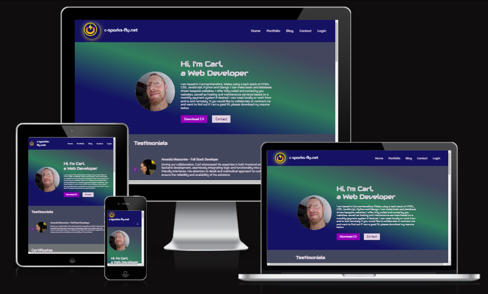
</p>


Hello, welcome to the project's readme document.
This project utilises a full-stack framework, incorporating Django, Python, JavaScript, CSS, and HTML. My objective is to develop a responsive website that enables me, as the site owner, to perform CRUD operations to make updating my portfolio simple. This project is to be my own personal website to promote myself as a web developer.


**[Visit my website](https://my-portfolio-final-project-f3fce3db626e.herokuapp.com/)**

# Overview

This website is to act as major promotional point for me entering the market as a Full Stack Developer, it is to communicate value to visitors. The site is to be under construction for a while and the current state of the site represents the Minimum Viable Product (MVP) having been reached. It is a starting point for further development, with new features planned to help me organise my workflow in the back end. More content is to be added after some websites have been built for real world use (initially these websites will be built for free) and the blog articles have their full content in place. 

The website being built as a final project piece for a fullstack bootcamp is specified to require CRUD functionality. This is fulfilled here by making a gated dashboard (only available to superuser), where portfolio entries can be uploaded, edited and deleted as required. This is akin to functionality already present in django admin but, it is accessed faster and has a nicer UI. This aims to make the experience of updating the site both faster and more enjoyable and has set the stage for future dashboard functions to be added, such as To Do Lists.

# Table of Contents

1. [UX](#ux)
    - [User Stories](#user-stories)

2. [Scope](#scope)
    - [Features](#features)
    - [Future Features](#future-features)

3. [Structure](#structure)

4. [Wireframes](#wireframes)

5. [Database schema](#database-schema)

6. [Surface](#surface)

7. [Technologies Used](#technologies-used)

8. [Testing](#testing)

9. [Deployment](#deployment)

10. [Credits](#credits)

#
# UX

For the UX planning I researched by web searching other people offering web developer services in Carmarthenshire. I decided to go with a clean, simple and personable approach, while showcasing some design abilities


The target market for 'c-sparks-fly.net' includes:

- Individuals wanting websites built.
- Small to medium sized businesses, whose requirements are most likely to fall within my skillset.
- Recruiters who may be visiting while scouting for potential employees.
- Other developers, who may mention the site to colleagues and this lead to networking or other opportunities.

These users will be looking for:

- A website that provides context and shows my ability as a developer.
- Examples of my work.
- The ability to contact me easily if they want to.
- A visually appealing experience.
- A user-friendly interface with intuitive navigation to access content and resources.
- The ability to post, comment and like events an provide feedback reviews.
- Links to explore my work further.


The website currently provides these features. The design is colorful without being overwhelming and suited to having good visibility on monitors and screens in a variety of lighting conditions. The site being database driven and with image static files being accessed by cloudinary has a fast load time.

## User Stories
These User stories have been used to help structure the direction of this project, to prioritise features and are also used later in this readme file as a basis for demonstrating testing, using these as core criteria.

- As a ** Site Owner** I can **provide my CV for download , so that ** it is easy for prospective employers to access.
- As a ** Site Owner** I can upload completed projects, so that ** I can show my ability**.
- As a Site Owner ** I can ** share my abilities and tech stack, so that prospective employers can see where I am at.
- As a Site Owner I can share my formal achievements, so that viewers can see proof of my learning.
- As a **client/co-worker ** I can share a positive experiences, so that **I can show appreciation and enhance public trust in Carl **.
- As a ** Site Owner** I can post articles, so that i can share my thoughts and interests..

- As a ** Site User** I can **upload my contact details and a message **, so that **I can be reached by Carl and explain my interest **.

   <p align="center">

</p>

#
# Scope

## **Features**

### **Home Page**

1. **Navigation Bar**
   - The navigation bar appears on every page so users can easily navigate through the site.
   - Navigation bar has links for 'Home', 'Portfolio', 'Blog', 'Contact' and 'Login(superuser only)'. As a logged in superuser (site owner) there is nav link to 'Dashboard' and 'Login' is replaced by 'Logout'. The site's Logo acts as a universal link back to the main home/page across the site also.
<p align="center">

</p>
   - The navigation links appear in the nav bar to the right hand side on screens above 767px viewport widths. Below that width the navbar collapses into a 'hamburger' style toggle icon, which when clicked, calls a drop down style navigation menu to appear to the left of the viewport.
   - Further forms of Navigation outside of the NavBar itself are detail view pages for Blog articles and Portfolio entries, which are accessed from title based links that are dynamically generated from the relevant object's properties in the databse. The site owner in the Dashboard Page has a handy button 'Admin' which takes them to Django's built in admin area.
   - The navbar is fully responsive, collapsing into a hamburger menu for medium and small screen size

   <p align="center">
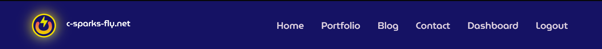
</p>
   <p align="center">
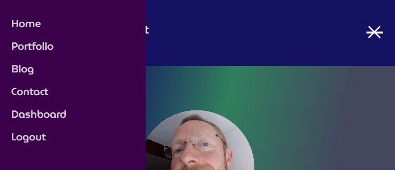
</p>

   - Other links icludes email links in the sites footer bar and on the contact page. Clicking on the email links invokes a 'mailto' function that calls up options for which email provider the site user would like to use and populates the email services address bar with my email address to facilitate easy access to email.

  <p align="center">

</p>

   - External links are generated dynaically for Portfolio entries and populate in the Portfolio detail pages, these take the browser to live deployments of the site being showcased.  The footer currently also has a link to the site owners Github profile.

2. **Landing Page Banner Area - Portrait, Bio, Buttons with Swirling Background**
   - The landing area features a screen with a Welcome, a portrait photo of myself as the site and business owner, a quick intro text to orient the user and a few immediate calls to action - Download CV (Button) and Contact (Button). The backfrop uses houdini CSS rotating gradient styling to form an attractive feature, in otherwise blank space, facilitating an uncluttered yet attractive appearance.

  <p align="center">
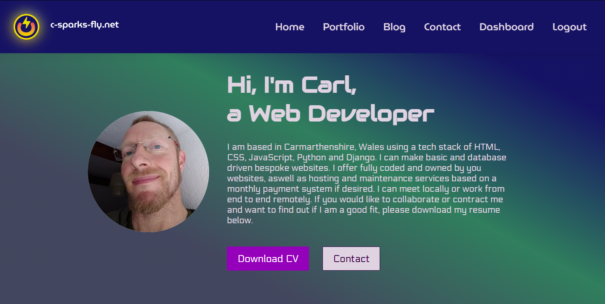
</p>

3. **Testimonials Section - Slider of promotional reviews**
   - The Testimonials sections is placed directly below the banner area to inspire early confidence in the visitor. The use of a manual slider encourages engagement and gives the reader the choice of time it taskes to read each review, as opposed to the use of an automated scrolling 'conveyor belt' of reviews. These have a personable and human quality, being from individuals.

    <p align="center">
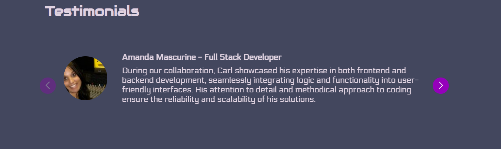
</p>

4. **Certificates Section - Manual slider of visible accreditations**
   - As with the Testimonials, manual slider lets users peruse at their own pace. The certificates being placed here attempt to reinforce a growing sense of confidence in the reader as they scroll down the page. These show more formal kinds of recognition.

    <p align="center">
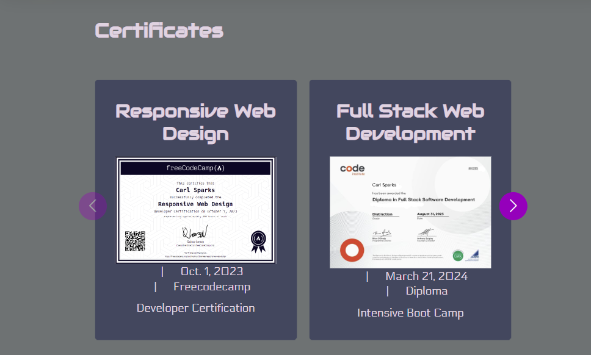
</p>

5. **Featured Work Section - Clickable Briefs with images of completed projects**
   - This is a list view of the portfolio projects currently on the site. These feature an image, clickable (and hoverable) links to more details about that project on its own page for further reading and exploration via external links there.

    <p align="center">
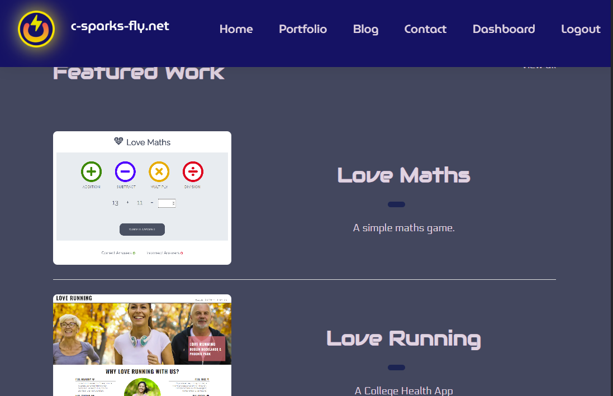
</p>

6. **Skills Section - Icons and Labelled Progress Bars**
   - This section shows the most pertinent tech stack of the site owner. Icons of the individual technologies are used as an attractive 'key' to the left of the labelled progress bars to the right. These are updateable in admin area as the site owner's skills change and develop. These aim to attractively give an honest portrayal of tech abilities, which may be of especial importance to recruiters looking at the site, so that their expectations are realistic when contacting.

    <p align="center">
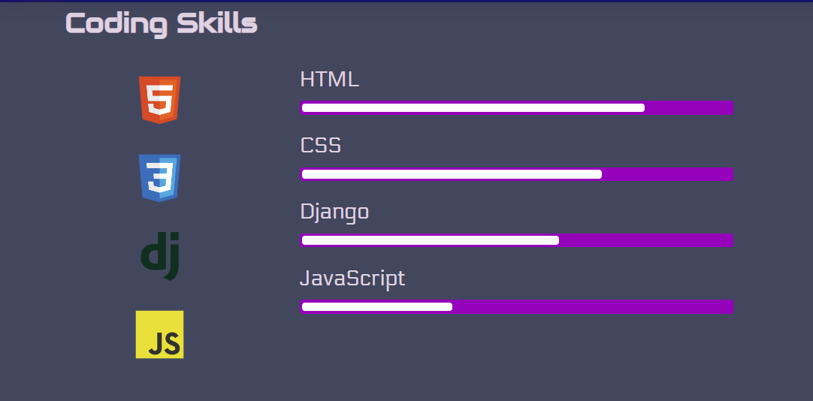
</p>

7. **Recent Posts - Slider view of Blog posts currently available**
   - These tiles have clickable (and hoverable) links to articles. This feature is currently being used to convey information, a sense of the owner's personality and also offer details about services not currently covered in other areas of the site.

    <p align="center">
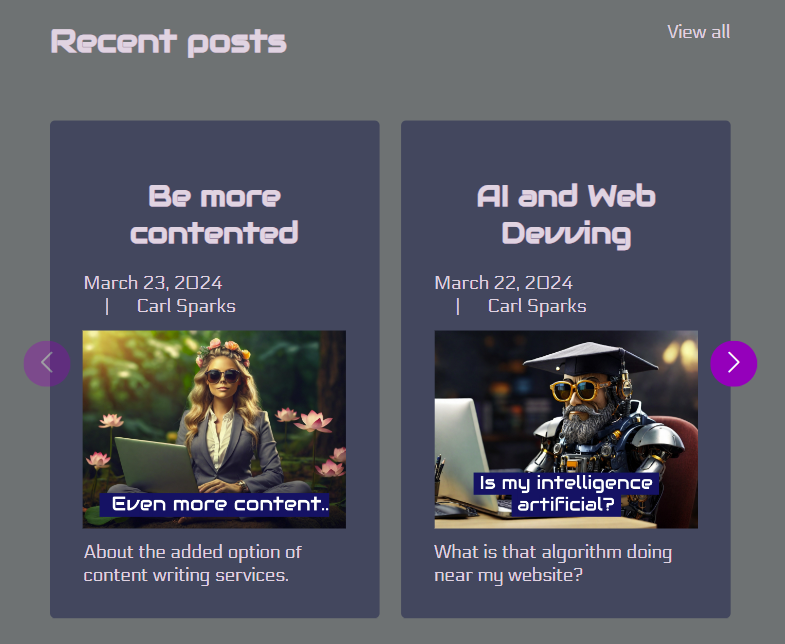
</p>

### **Portfolio Page**
    - This page simply comprises an attractively staggered tiling layaout of the items that users can find out more about by clicking through to the details by hovering over the images which are each hoverable links in themselves. Images here are given more space than in the homepage list view, so that people can see the kind of aesthetic quality of the site owners recent projects, even if they do not want to know more about each one. If they do want to explore further they can click on them to read more into the projects and from there click to any of the sites that are currently live. 
    
    These provide links to detail view if users have not scrolled down the long homepage but rather gone straight towards Portfolio via the Navbar.

<p align="center">
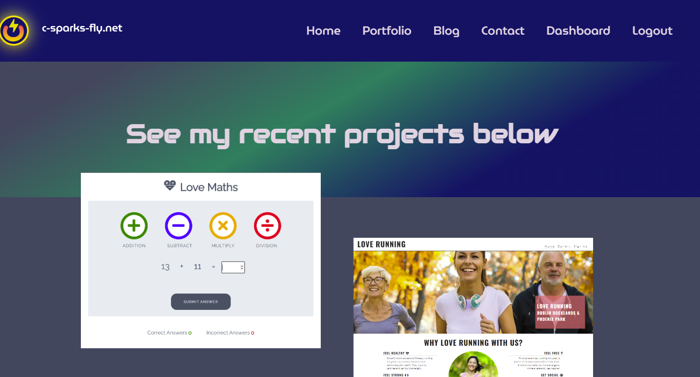
</p>

### **Blog Page**

1. **Page Info**
    - Almost identical to the Portfolio page this Blog page simply comprises an attractively staggered tiling layaout of the items that users can find out more about by clicking through to the details by hovering over the images which are each hoverable links in themselves. These links go to detail views if users have not scrolled down the long homepage but rather gone straight towards Blog via the Navbar. 
    
    Images here are given more space than in the homepage list view. From here, users who want to explore further can click on them to read the articles themselves. 

 <p align="center">
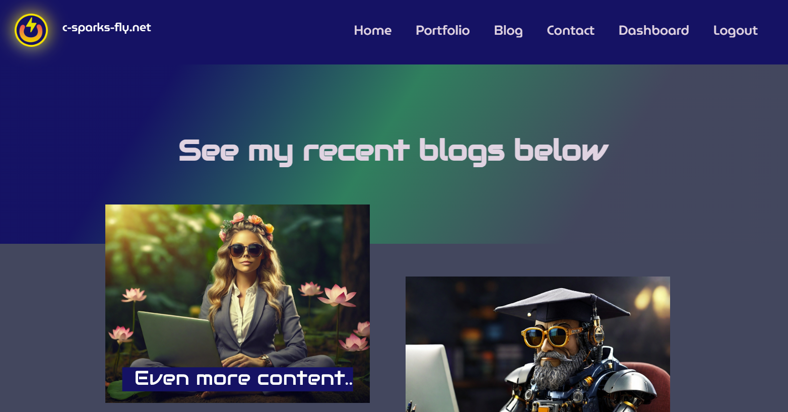
</p>

### **Contact Page**
1. **Page Info**
    - This page provides an attractive, yet simple form layout for users to be able to send a message and their contact details to the site owner, such as for making enquiries relating to hiring them for a project. There is also an upfront and obvious link providing alternative means of emailing the site owner, if that is preferable to the user. This hoverable link nactivates a 'mailto' html function, calling up the user's email provider as a window and populating the address bar of the email with the site owner's email address.

<p align="center">
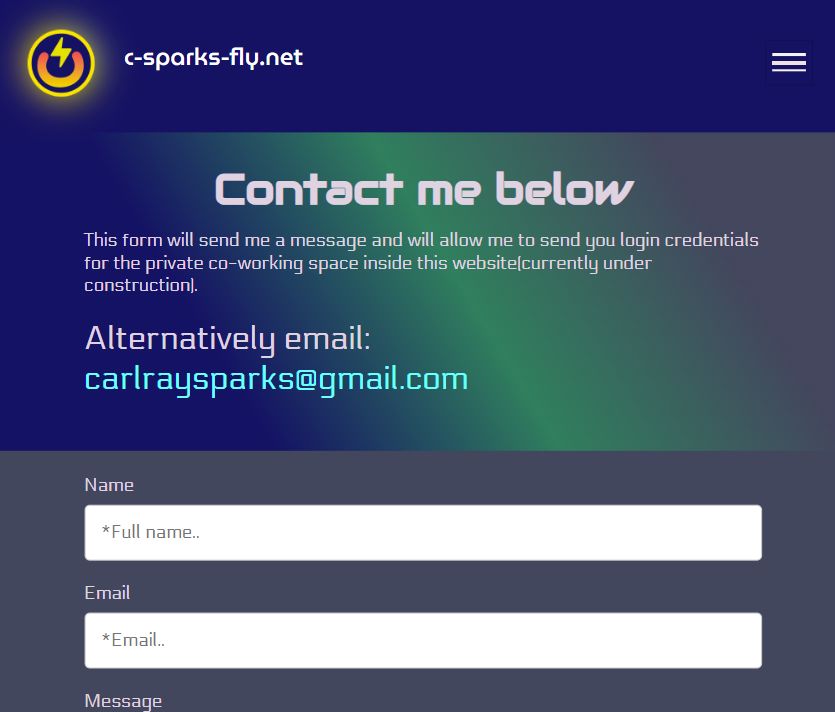
</p>

<p align="center">
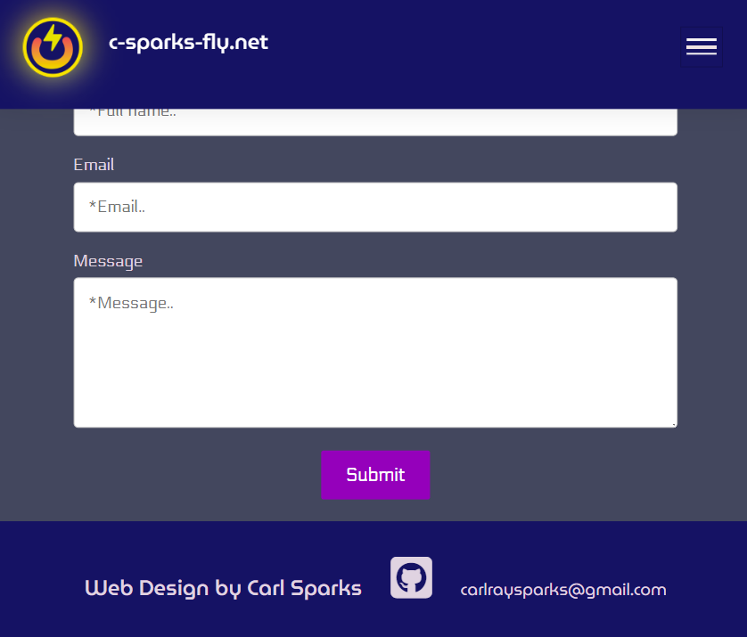
</p>

    Upon submission of the form a popup appears saying 'Thank you. I will be in touch soon.' to alert the user that submission has occured.

<p align="center">
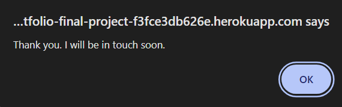
</p>

### **Login Page**
1. **Page Info**
    - This comprises a simple form for the site owner to fill in username and password which have been formerly set using:-
     ```console
     python3 manage.py createsuperuser
     ```
    - Upon submission the site owner is welcomed back with an alert and the Navbar changes to show different options.

<p align="center">
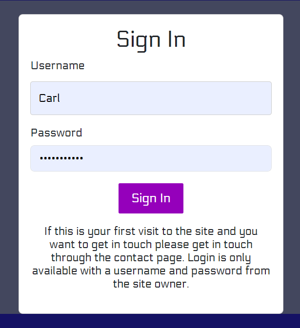
</p> 

<p align="center">
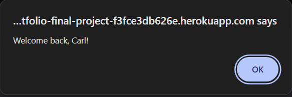
</p>

<p align="center">

</p>

### **Dashboard Page**
1. **Page Info**
   - This page is purely for the use of the site owner and comprises the first implementation of CRUD functionality on the site. CRUD is an acronym for Create, Retrieve, Update, Delete and makes full use of database driven functionality. This was a coere assessment criteria for this project at it's inception. This functionality is fulfilled by the use of a few interactive functional items which comprise the basic system of the dashboard interface. 

<p align="center">
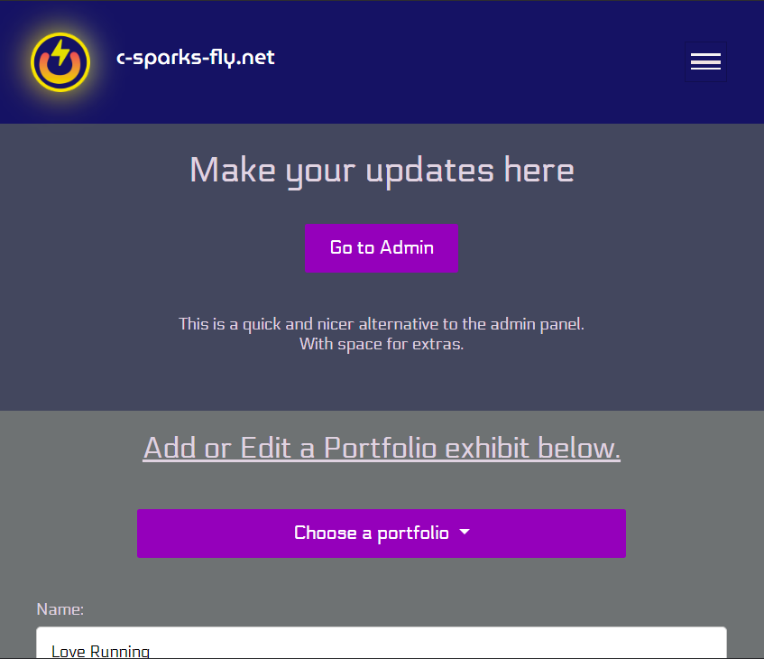
</p>


2. **Creation and Editing Form**'
   - The form fields being based on the Portfolio Model in the project's 'main/models.py' file allow the user to input the required info to create a new portfolio entry in the form of text entries for a portfolio item's 'name', 'description', 'body'(the main blurb about the website being featured), 'URL'(external link to site). An image file can also be uploaded here from the user's hardware device.

   This form is also used for editing elements of an esisting portfolio entry, where the form fields are populated with data retrieved from the database that reflects the portfolio chosen from the drop down menu that is selected via a dropdown menu. This dropdown menu is accessed by clicking on the button above the form.

3. **Portfolio Choice Button**
   - Above the portfolio entries management form is a large button that has a dropdown icon on it and reads 'Choose a Portfolio'. Ehen clicked a dropdown menu of hoverable and clickable links appear in the menu, reflecting active, current portfolio items that can be edited.

<p align="center">
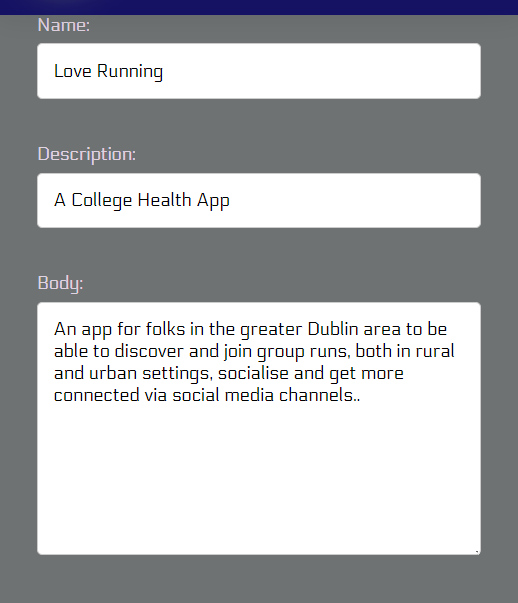
</p>

4. **Submit Buttom**
   - This button commite changes made to the database for reflection in the content that populates the website's relevant pages

<p align="center">
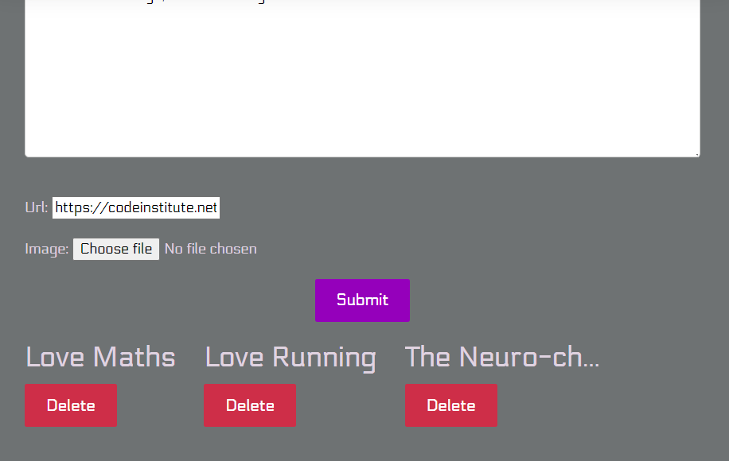
</p>

5. **Delete Buttoms**
   - These buttons are coloured red to reflect their potentially 'dangerous' nature. The buttons populate the bottom of the page dynamically and allow whole entries to be deleted from the database permaneently.

6. **Go To Admin Button**
   - Toward the top and right of the page is this button, allowing clickable access to the django admin area, without the need to manually alter the url in the address bar each time.


## Design

### Imagery
1. **Large complex images**
- The imagery used is copyright free and generated from use of original prompts via [Leonardo AI](https://app.leonardo.ai/ai-generations) .
- Commonalities in prompt typeforms to reproduce similarity of style consistency across images are as follows.
- Main prompt backend phrases were 'fantasy, beside a laptop,  high quality, high detail, 32k ,masterpiece'
- Negative prompts across all images were not used. 
- Model used for this was - Leonardo Diffusion XL (Finetuned Model).

<p align="center">
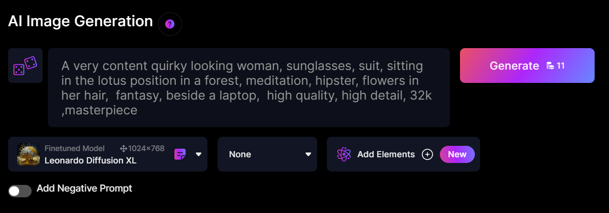
</p>

2. **Logo Creation**
- Free Clipart was found online as transparenciies and imported to [Photopea Editor Online](https://www.photopea.com/)

3. **Experimental CSS Form - Houdini**
- The swirling effects produced in the main banner areas across the site and comprising the flickering effect used in the logo can be found at [This Codepen](https://codepen.io/kevinpowell/pen/QWVKZjx). A walkthrough by Kevin Powell can be found at [Youtube Walkthrough](https://www.youtube.com/watch?v=-VOUK-xFAyk). This Houdini CSS is not fullyt supported across all browsers, but all Chromium based browsers do support it. In unsupportive browsers the effect is just dimished or can go static, so it was not considered a design risk overall, as it adds some flair to the sites appearance. Load times do not seem adversely affected either.

4. **Typography** 
- The font choices were divided into 3 forms. they can be implemented by pasting this code into the head of a css stylesheet -
``` console
@import url('https://fonts.googleapis.com/css2?family=Audiowide&family=Electrolize&family=MuseoModerno:ital,wght@0,100..900;1,100..900&display=swap');

```
- The website name in the Navbar and footer text uses "MuseoModerno".
- The main titles utilise "Audiowide".
- General text content uses "Electrolize".
- These fonts were chosen to impart a sort of tech flavour into the website while also being legible choices, where they are used.

5. **Colors**

<p align="center">
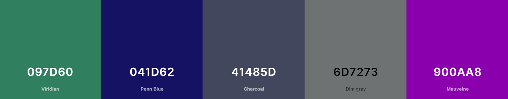
</p>

### Future Features
- Services Page/s with more specific info and approximate pricing structure.
- ToDoList (CRUD) in Dashboard page to aid my workflow.
- Login for users to message in project collaboration messenger area.
- in dashboard - links to specific currently being worked on repos at Github.

#
# Structure

So far this MVP website is made from one app called - main. Future development to include a messenger using channels and redis would necessitate use of a second app. Currently the site does not wander away from the core structure visible in the Navbar.

The website is quite simple structurally and considerable flexibility over exact layout was afforded in this case by the site developer also being the client! 

Wireframes were built for this project at the start to aid in conceptualisation and visualisation. they can be found here. 
- [Wireframes](assets/documents)

# Database Schema

<p align="center">
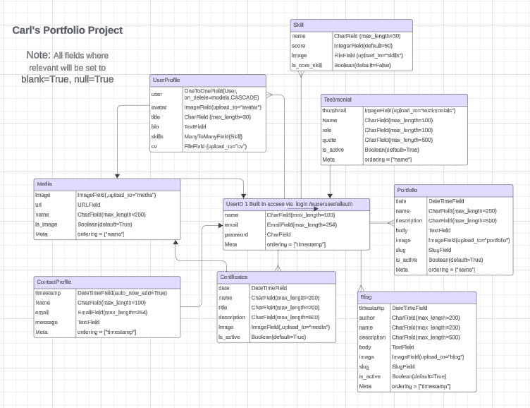
</p>

- The database used is a free limited database from [Neon](https://neon.tech/)

## Technologies Used

### Languages Used
- [HTML5](https://en.wikipedia.org/wiki/HTML5)
- [CSS3](https://en.wikipedia.org/wiki/CSS)
- [JavaScript](https://www.javascript.com/)
- [Python](https://www.python.org/)

 ## Frameworks, Libraries & Programs Used

[GitHub](https://github.com/) - GitHub is a web-based platform for version control using Git, enabling collaborative software development and hosting of code repositories. GitHub connects to GitPod and Heroku. *****ADD HOW IT HELPED HERE ON EACH LINK****

[GitPod](https://gitpod.io/workspaces) – Connected to GitHub, GitPod hosted the coding space, allowing the project to be built and then committed to the GitHub repository. 

[Heroku](https://www.heroku.com/) - Connected to the GitHub repository, Heroku is a cloud application platform used to deploy this project so the backend language can be utilised/tested. 

[Django](https://www.djangoproject.com/) - Django is a high-level web framework for building web applications rapidly with a clean and pragmatic design.

[Neon](https://neon.tech/) - Neon is a hosted PostgreSQL database service that can be seamlessly integrated with Django applications, providing scalable and reliable database solutions.

[Gunicorn](https://gunicorn.org/) - Gunicorn is a pure-Python HTTP server for WSGI applications.

[Dj Database URL](https://pypi.org/project/dj-database-url/) - This allows you to utilize the 12factor inspired DATABASE_URL environment variable to configure your Django application.

[Bootstrap](https://getbootstrap.com/) - Bootstrap is a front-end framework for developing responsive and mobile-first websites quickly and efficiently.

[Cloudinary](https://cloudinary.com) - Cloudinary is a cloud-based media management platform that offers solutions for storing, optimizing, and delivering images and videos for web and mobile applications.

[Summernote](https://summernote.org/) - Summernote is a Django app that enables users to easily integrate a rich text editor into their web applications, enhancing event creation and description functionality.

[DALL-E3](https://openai.com/) - DALL-E3 is an advanced AI model developed by OpenAI that generates images from textual descriptions.

[TinyPNG](https://tinypng.com/) - TinyPNG is a website that offers image compression services to optimize image files for faster loading on webpages while maintaining visual quality.

[Google Fonts](https://fonts.google.com/https://fonts.google.com/) - Google Fonts is a collection of free, open-source fonts that can be easily integrated into websites and other digital projects to enhance typography.

[Font Awesome](https://fontawesome.com/) - Font Awesome is a library of scalable vector icons that can be easily customized and used to enhance the visual appeal of websites and applications.

[Beautify](https://www.jpkc.com/tools/beautify/) - Beautify is a code formatter tool that automatically formats code to improve readability and consistency.

[Balsamiq](https://balsamiq.com/) - Balsamiq is a wireframing tool used for creating low-fidelity mockups of user interfaces, allowing for quick and easy visualization of design ideas.

[Lucidchart](https://lucid.app) - Lucidchart is a web-based diagramming tool that allows users to create and collaborate on flowcharts, ERDs, and other visual representations of data and processes.

[Am I Responsive](http://ami.responsivedesign.is/) - Am I Responsive is a web tool that allows users to quickly preview how their website appears on various devices and screen sizes, helping to ensure responsiveness and compatibility across platforms.

[W3C CSS Validator](https://jigsaw.w3.org/css-validator/) - The W3C CSS Validator is a tool used to check the validity and syntax of CSS code, ensuring compliance with web standards set by the World Wide Web Consortium (W3C).

[W3C Markup Validator](https://validator.w3.org/#validate_by_input) - The W3C Markup Validator is a tool used to check the validity and syntax of HTML code, ensuring compliance with web standards set by the World Wide Web Consortium (W3C).

[JSHint](https://jshint.com/) - JSHint is a static code analysis tool used for checking JavaScript code for errors, potential problems, and stylistic inconsistencies.

[Pep8ci](https://pep8ci.herokuapp.com/) - Pep8ci provides Python developers with a tool to check their code against the PEP 8 style guide for adherence to coding standards.

[Lighthouse](https://developer.chrome.com/docs/lighthouse) - an open-source tool used for auditing web page quality, including performance, accessibility, SEO, and cross-browser testing.

# Testing

## User Story Testing

### **Testing Users Stories form (UX) Section**


### Validator Testing

<!-- #### HTML Validator
- [Results for event_list.html](#)
- [Results for event_detail.html](#)
- [Results for event_form.html](#)

#### CSS Validator
- [Results for styles.css](#)

#### Browser Compatibility
- Chrome Version 90.0.4430.212
- Firefox Version 88.0.1
- Safari on macOS Catalina (Safari Version 14.0.3)

### Test Cases and Results
- [Test Cases](#) -->

## Bugs and Issues
-

# Deployment

## Deploymrnt of this site was as follows

- Here are the basic steps for deploying a project from Gitpod to Heroku and linking it to GitHub using manual deployment:

## Prepare Your Project:

- Ensure your project is ready for deployment and is working as expected locally.
Make sure your project includes a requirements.txt file listing all the dependencies and a Procfile to specify the command to start the web server.

## Create a GitHub Repository:

- If you haven't already, create a GitHub repository for your project.
Push your project code to this GitHub repository.

## Set Up Heroku Account:

- Sign up for a Heroku account.
Install the Heroku CLI (Command Line Interface) on your local machine.

## Create a New App on Heroku:

- Log in to your Heroku account via the terminal using the Heroku CLI.
Create a new app on Heroku using the heroku create command.

## Link Heroku App to GitHub Repository:

- Go to the "Deploy" tab of your Heroku app dashboard.
Under "Deployment method," select GitHub as the deployment method.
Search for your GitHub repository and connect it to your Heroku app.

## Enable Manual Deployment:

- Disable automatic deploys to ensure that changes pushed to your GitHub repository do not trigger automatic deployments on Heroku.
You can do this by clicking on the "Enable Automatic Deploys" button and then turning off the "Wait for CI to pass before deploy" option.

## Deploy Your App:

- Manually deploy your app by clicking the "Deploy Branch" button in the "Manual deploy" section.
Choose the branch you want to deploy from (e.g., main or master).

## Wait for Deployment:

- Wait for the deployment to finish, and check the logs for any errors.

## Test Your Deployed App:

- Once the deployment is complete, open your app using the provided Heroku URL and test that it works as expected.
By following these steps, you can manually deploy your project from Gitpod to Heroku and link it to GitHub for version control.

- Once the master branch has been selected, the page will be automatically refreshed with a detailed ribbon display to indicate the successful deployment.

- Any changes pushed to the master branch will take effect on the live project.

The live link can be found [My Portfolio Repository](https://github.com/Sparkeeee/carls-portfolio).

## How to clone the repository
1. Go to the GitHub repository on GitHub.
2. Click the "Code" button to the right of the screen, click HTTPs and copy the link there.
3. Open a GitBash terminal and navigate to the directory where you want to locate the clone.
4. On the command line, type "git clone" then paste in the copied URL and press the Enter key to begin the clone process.

## Django and Heroku 
- I followed the Code Institute's Coding Coach instructional video to install and set up the Django framework.

# Credits
- [Django Crispy Forms] (https://django-crispy-forms.readthedocs.io/en/latest/install.html) - Instructional Documentation help
- [Whitenoise Docs] (https://whitenoise.readthedocs.io/en/latest/django.html) - Instructional Documentation help
- [Stack Overflow] (https://stackoverflow.com) - Crispy Forms instructions help
- [Django Summernote Docs] (https://github.com/summernote/django-summernote) - Instructional Documentation help
- [ChatGPT] (https://chat.openai.com) - Answering my many questions
- [LeonardoAI](https://openai.com/dall-e-3) - Created all my ideas via text and translated them into an image

## Media
- The icon in the footer was taken from Font Awesome.
- The fonts used were imported from Google Fonts.
- My favicon was created by me fusing free clipart and altering/ transforming this in Photopea.
- My main images were all created by LeonardoAI.

## Acknowledgments
- I am grateful to my mentor Ronan for providing valuable feedback.
- Coding coach Kevin, for his very helpful SME videos.
- I am grateful to my good friend Dave, who spent his time helping me fix a few css bugs.
- Thanks to Amanda for support around the creation of this document.
- Thanks to the whole Cohort and staff at Code Institute for bringing me to this stage.
- Thanks to my supportive partner Heike.
