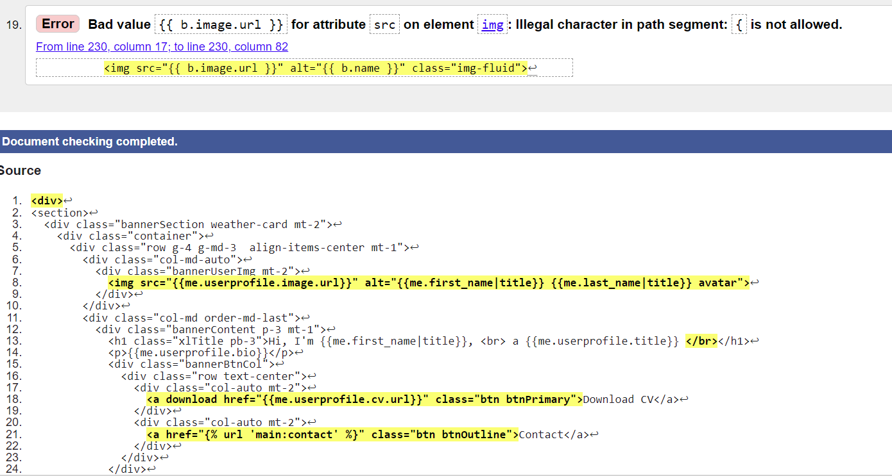
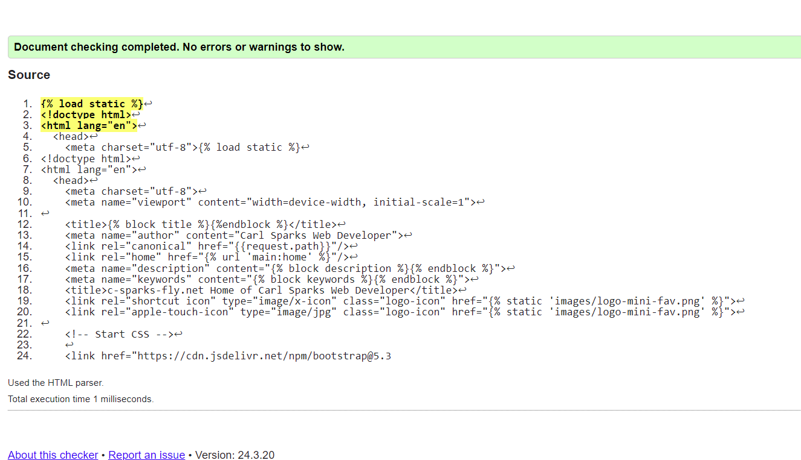
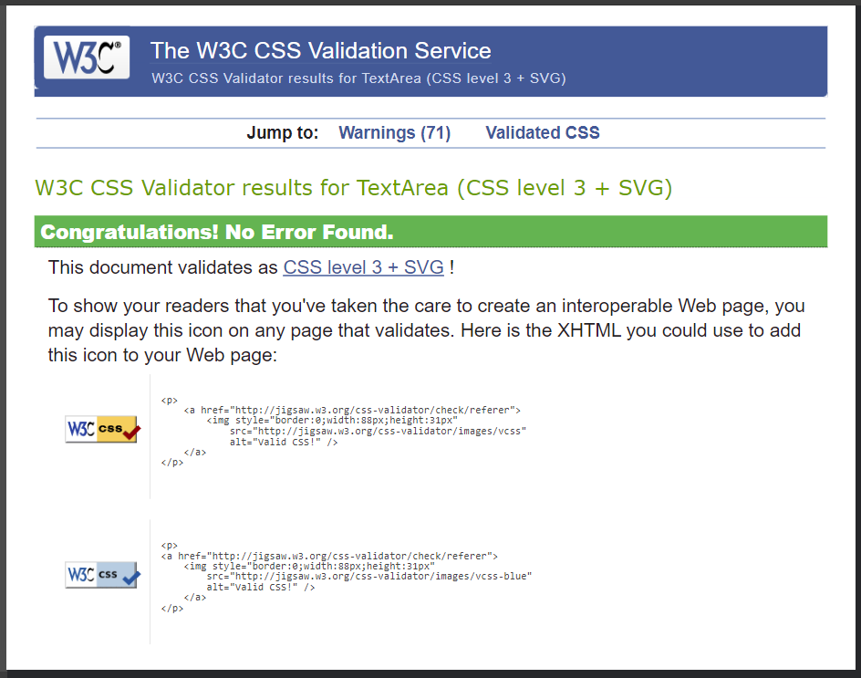
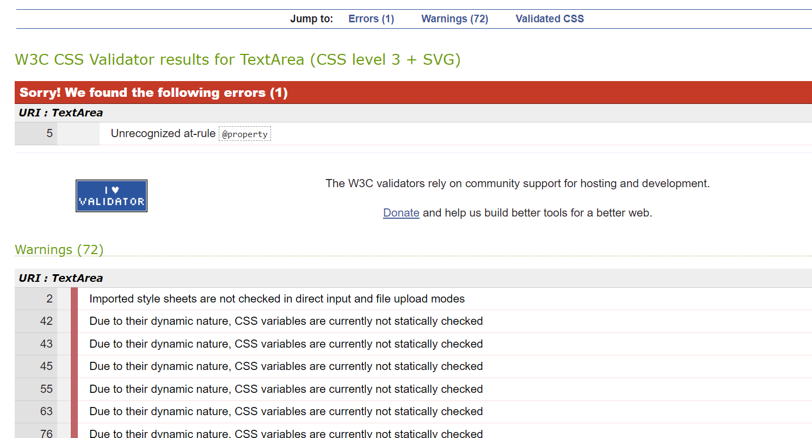
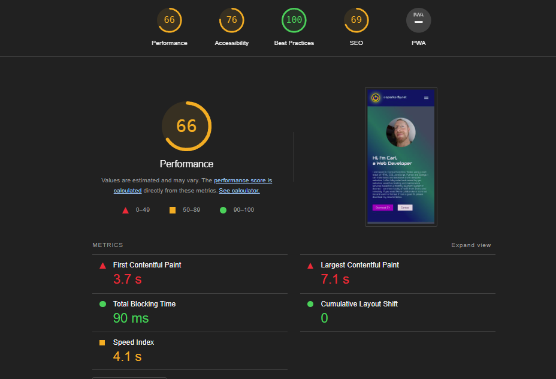
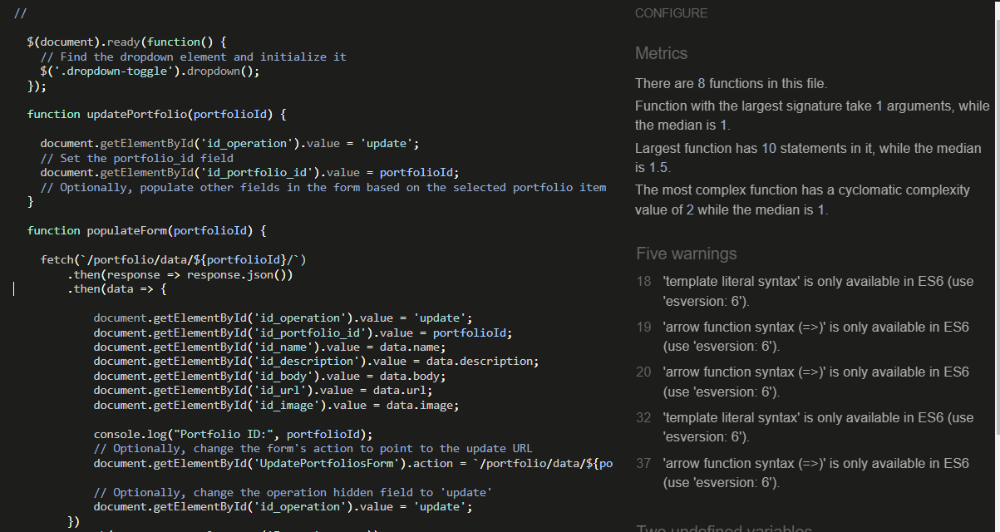

# Testing

- Manual testing was done by compaaring User stories against actual performance and all features required for the MVP were present and working.

## Online Direct Input Tests

### Validator testing at W3C.

- [https://validator.w3.org/](https://validator.w3.org/nu/#textarea)

- HTML Testing was carried out for the main pages but there are issues with the online testing tool. Although the most highly highly regarded testing tool around the HTML tester kept throwing errors that were related to the inserted Django Template Tags of format -    {{ this. content.tag }} . Other types of error were not present in the tests.

- See examples below 

 

 

- CSS Validation at W3C 

- Without Houdini components

 

- including the Houdini @property tag

 

### Lighthouse Report

- Improvements in load times seem to be potentially drastic and related mainly to the 'Bio' textarea of the Banner section of index.html.
- Aceessibility can be improved.
- Best practices were found to be perfect.

### Python Linter

- See Below an example of results from the use of this [Python Linter](https://pep8ci.herokuapp.com/)

- above depicts the type of results typically found throughout the Python files of this project. These are formatting type issues relating to switching between the use of tabs and space bar indentation methods and highlight over blank lines, to aid in the code readability.

### jshint 

- I only had 1 small Javascript file in this project which showed no serious errors when tested. There were some warnings about certain features only being available in ES6. 

